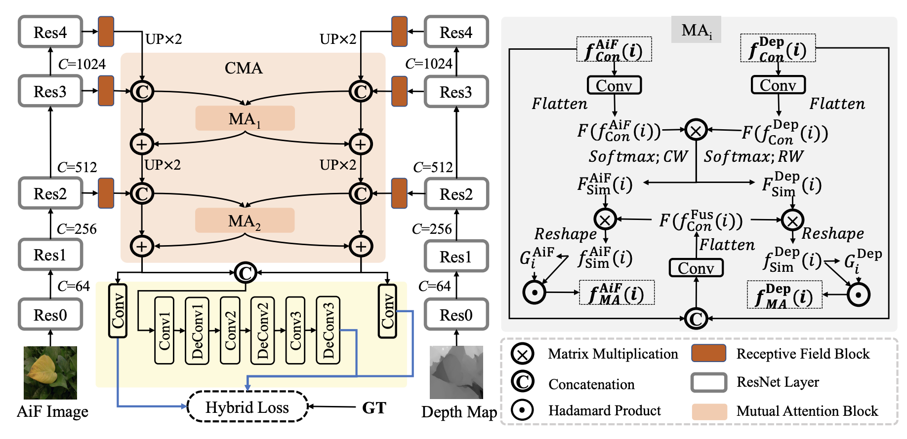

# [CMA-Net: A Cascaded Mutual Attention Network for Light Field Salient Object Detection](https://arxiv.org/abs/2105.00949)

------

# Introduction

      
    <em> 
    Figure 1: An overview of our CMA-Net. RGB-D high level features extracted from duel-branch encoder are fed into two proposed cascaded mutual attention
modules, followed by a group of (de-)convolutional layers used in BBSNet. The abbreviations in the figure are detailed as follows: AiF Image = all-in-focus
image. GT = ground truth. Resi = the ith ResNet layer. (De)Conv = (de-)convolutional layer. MAi = the ith mutual attention module. CMA = cascaded
mutual attention module. CW = column-wise normalization. RW = row-wise normalization.
    </em>

we propose CMA-Net, being similar to [SA-Net](https://github.com/PanoAsh/SA-Net), which consists of two novel cascaded mutual attention modules aiming at fusing the high level features from the modalities of all-in-focus and depth. Our proposed CMANet outperforms 30 state-of-the-art SOD methods on two widely applied light field benchmark datasets. Besides, the proposed CMA-Net is able to inference at a speed of 53 fps, thus being much faster than the top-ranked light field SOD methods. 

------

# Predictions

Download the saliency prediction maps at [Google Drive](https://drive.google.com/file/d/1hjPzINpea_VoGDhpxLDqi4xAp7TNjrBh/view?usp=sharing) or [OneDrive](https://1drv.ms/u/s!Ais1kZo7RR7Li3arNvMpXvhKcExn?e=HqlebD).

------
 
# Inference

Download the pretrained model at [Google Drive](https://drive.google.com/file/d/1JwMu21sJaOta3E2lyf-W-QnucpYa5Eur/view?usp=sharing) or [OneDrive](https://1drv.ms/u/s!Ais1kZo7RR7Li3fedIVGH9kevqn8?e=X0eadg).

------

# Training

Please refer to [CMANet_train.py](https://github.com/PanoAsh/CMA-Net/blob/main/CMANet_train.py).

------

# Contact

Please feel free to drop an e-mail to yi.zhang1@insa-rennes.fr for any questions. 
